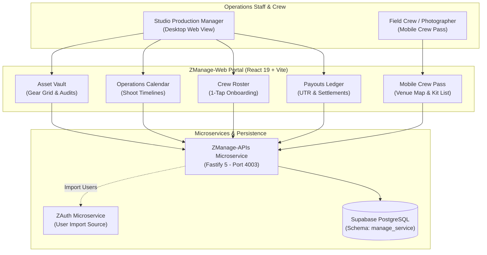

# ZManage-Web — Internal Operations, Asset Vault & Crew Management Portal

> **Multi-Tenant Operations Command Center, Hardware Inventory Vault, Timeline Calendar & Mobile Crew Pass**  
> Powers day-to-day shoot logistics, gear condition auditing, freelance crew scheduling, and worker compensation ledgers for the Zorvik Tech ecosystem.

[](VERSION.md)
[](https://manage.zorviktech.com)
[](https://react.dev/)
[](https://vitejs.dev/)
[](https://www.typescriptlang.org/)
[](https://www.framer.com/motion/)
[](LICENSE)

---

## 🌐 Production Deployments

- **Live Production Operations Portal**: [https://manage.zorviktech.com](https://manage.zorviktech.com)
- **Local Development Server**: `http://localhost:3005`
- **Edge Deployment**: Cloudflare Pages / Vercel

---

## 🌟 Executive Overview

**ZManage-Web** is an ultra-futuristic internal operations dashboard designed for modern creative agencies and studio production managers. Styled with **Glassmorphism 2.0** on a deep cyber-obsidian canvas, it streamlines equipment management, shoot scheduling, crew allocation, and payout tracking into a fast, intuitive web application.

### Key Capabilities
- **Hardware Asset Vault**: Real-time inventory grid tracking cameras, cinema lenses, drones, audio rigs, and lighting packs with check-out and return condition inspection audits.
- **Operations Calendar & Timeline**: High-density interactive timeline preventing shoot double-booking and visualizing equipment dispatch status.
- **1-Tap Crew Onboarding**: Instant crew roster generation importing users from `auth_service.tbl_client_users` with selective inclusion/exclusion controls.
- **Mobile Crew Pass**: Smartphone-optimized mobile pass for location crew featuring direct Google Maps venue links, assigned camera kit lists, and 1-tap arrival check-in.
- **Worker Payouts & Compensation Ledger**: Comprehensive earnings breakdown calculating overtime, contract day rates, and settlement status with bank UTR audit records.

---

## 🏛️ System Architecture & Data Flow



---

## 🚀 Core Modules & Views

### 1. 🧰 Hardware Asset Vault (`/assets`)
- Real-time catalog of high-value equipment with serial numbers and condition tags (`excellent`, `good`, `fair`, `damaged`, `in_repair`).
- Modal for gear dispatch (assigning equipment to specific shoots and crew leads).
- Return inspection modal with condition degradation notes and maintenance flags.

### 2. 📅 Operations Timeline Calendar (`/schedule`)
- Multi-day, weekly, and monthly gantt-style timeline for client shoots.
- Real-time collision alerts warning if a camera or team member is committed to another shoot at the same hour.

### 3. 👥 Crew Roster & Onboarding (`/crew`)
- Unified crew directory displaying day rates, overtime multipliers, and active shoot count.
- Reusable `CustomSelect` component with Glassmorphism 2.0 animations and active state checkmarks.
- 1-Tap bulk onboarding modal to import platform users with granular role assignment.

### 4. 📱 Mobile Crew Pass (`/pass/:id`)
- Responsive smartphone web pass designed for field photographers on location.
- Live venue address with 1-tap Google Maps directions.
- Itemized gear manifest ensuring no lenses or batteries are left behind.
- 1-Tap *"I Have Arrived"* check-in alerting the production command center.

### 5. 💳 Worker Compensation & Payouts Ledger (`/payouts`)
- Aggregated financial ledger tracking completed gigs, hours worked, and bonus incentives.
- Mark settlements as `paid` with Bank UTR reference numbers and payment timestamps.

---

## 📁 Repository Directory Structure

```
ZManage-Web/
├── public/                  # Favicons, manifest, static icons
├── src/
│   ├── assets/              # Branding and vector assets
│   ├── components/
│   │   ├── ConfirmModal.tsx # Framer Motion spring confirmation dialog
│   │   ├── Navbar.tsx       # Glassmorphic navigation header
│   │   ├── ui/              # Reusable Glassmorphism 2.0 components
│   │   │   ├── CustomSelect.tsx
│   │   │   ├── Button.tsx
│   │   │   └── Modal.tsx
│   │   └── views/           # Core dashboard views
│   │       ├── AssetView.tsx
│   │       ├── CalendarView.tsx
│   │       ├── CrewView.tsx
│   │       ├── PayoutView.tsx
│   │       └── MobilePassView.tsx
│   ├── context/             # OperationsContext, AuthContext
│   ├── hooks/               # useConfirm, useAssets, useCrew
│   ├── lib/                 # API client, date formatting, helpers
│   ├── types/               # TypeScript interfaces (Asset, CrewMember, Shoot)
│   ├── App.tsx              # Main application router
│   ├── index.css            # Tailwind CSS & Cyber-Obsidian variables
│   └── main.tsx             # React 19 bootstrap
├── .env.example             # Documented environment blueprint
├── eslint.config.js         # Strict ESLint configuration
├── package.json             # Scripts and dependencies
├── vite.config.ts           # Vite configuration
└── VERSION.md               # Version changelog
```

---

## ⚙️ Environment Configuration (`.env`)

Create `.env` using `.env.example`:

| Variable | Required | Description | Example / Target |
| :--- | :--- | :--- | :--- |
| `VITE_MANAGE_API_URL` | Yes | ZManage-APIs microservice URL | `https://manage-api.zorviktech.com` |
| `VITE_SUPABASE_URL` | Yes | Supabase PostgreSQL project URL | `https://your-project.supabase.co` |
| `VITE_SUPABASE_ANON_KEY` | Yes | Supabase client anon key | `eyJhbGci...` |
| `VITE_SITE_URL` | Yes | Canonical web app URL | `https://manage.zorviktech.com` |

---

## 🛠️ Local Development & Quality Runbook

### 1. Install Dependencies
```bash
npm install
```

### 2. Start Vite Development Server
```bash
npm run dev
```
Accessible at `http://localhost:3005`.

### 3. Run Strict Linting (Zero-Warning Policy)
```bash
npm run lint
```

### 4. Code Formatting
```bash
npm run format
```

### 5. Production Compilation
```bash
npm run build
npm run preview
```

---

## 🚀 Production Deployment

### Cloudflare Pages
```bash
wrangler pages deploy dist --project-name zorvik-manage-web
```

---

## 👨‍💻 Founder & Architectural Leadership

**ZManage-Web** is designed, architected, and maintained by:

- **Founder & Lead Architect**: **Vikash Kumar Singh**
- **Email**: [vikash@zorviktech.com](mailto:vikash@zorviktech.com)
- **Phone / WhatsApp**: [+91 8409792083](tel:+918409792083)
- **LinkedIn**: [linkedin.com/in/itsmevikashkumarsingh](https://www.linkedin.com/in/itsmevikashkumarsingh/)
- **GitHub**: [@ItsMeVikashKumarSingh](https://github.com/ItsMeVikashKumarSingh)
- **Website**: [zorviktech.com](https://zorviktech.com)

---

## 📄 License & Intellectual Property

**Copyright © 2026 Zorvik Tech. All Rights Reserved.**

This software and its associated source code, design systems, algorithms, and documentation are the proprietary intellectual property of **Zorvik Tech**. Unauthorized copying, reproduction, distribution, reverse engineering, or commercial use is strictly prohibited without prior written consent.
